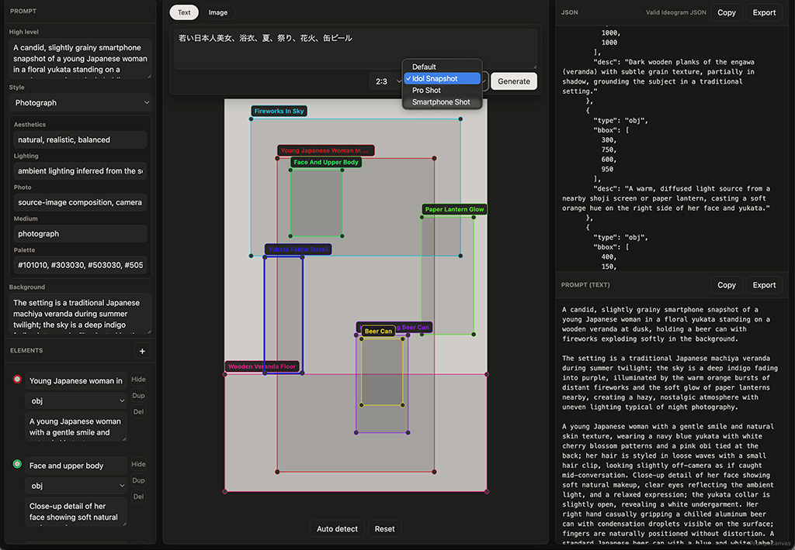
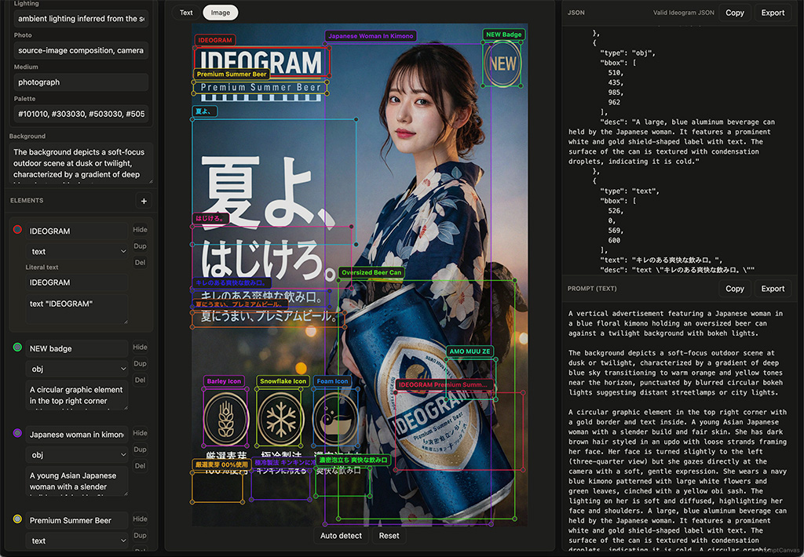

# PromptCanvas

画像またはテキスト説明から、画像生成AI向けのプロンプトを作成するローカル Web アプリです。

> **⚠️ 必須要件**: 本アプリの動作には **Vision対応のLLM** と、**LM Studio などの OpenAI API 互換エンドポイント** が必要です。`.env` の `VISION_API_BASE` / `VISION_MODEL` で接続先・モデルを指定してください（詳細は[設定（.env）](#設定env)を参照）。

Ideogram 4 の JSON プロンプト生成を中心に設計していますが、自然文（英語）プロンプトも同時に生成するため、**Ideogram 専用ではなく汎用の画像生成AIプロンプターとして使えます**。

bbox編集、スタイルプリセット、人物描写の詳細記述ルール、Textタブ用のテーマ別プリセットなど、プロンプト作成に必要な機能を一通り盛り込んでいます。

オリジナル（[cocktailpeanut/image-to-prompt](https://github.com/cocktailpeanut/image-to-prompt)、[cocktailpeanut/ideoprompt](https://github.com/cocktailpeanut/ideoprompt)）を参考にしましたが、コア処理を全面的に作り直しています。

## スクリーンショット

**Text タブ**（テキスト → プロンプト、プリセット選択あり）



**Image タブ**（画像 → プロンプト）



## 概要

**入力（2つのタブ）**
- **Text タブ**: テキスト説明とアスペクト比からレイアウト付きプロンプトを生成（アイデア → プロンプト）
- **Image タブ**: アップロードした画像を解析してプロンプト化（画像 → プロンプト）
  - **Vision LLM**（OpenAI互換エンドポイント）が画像全体を解析し、オブジェクトのbbox・description・caption・backgroundを一括生成
  - **PaddleOCR**（日本語・英語対応）がテキスト領域のbboxとテキストを検出

**出力（2つのパネル）**
- **JSON** — bbox付きの構造化プロンプト。**Ideogram チェックボックス**でbbox座標軸順を切り替え可能（ON: Ideogram 4 形式、OFF: Krea 2 など xy order 形式）
- **自然文（英語）プロンプト** — descriptionを結合した平文（他の画像生成AI向け）

どちらの入力からでも、UI でボックスのドラッグ・リサイズ・リネーム・複製・削除・非表示・追加、`style_description` の編集が可能で、両形式をコピー・エクスポートできます。

## Krea 2 での利用

JSON パネル上部の **Ideogram** チェックボックスを **OFF** にすると、Krea 2 向けの bbox 形式（xy order）で JSON を出力できます。

| チェック | bbox 形式 | 用途 |
|---|---|---|
| **ON**（デフォルト） | `[ymin, xmin, ymax, xmax]` | Ideogram 4 |
| **OFF** | `[xmin, ymin, xmax, ymax]` | Krea 2 など（xy order / Qwen形式） |

- Krea 2 は Ideogram 4 ほど厳密ではないものの、xy order (Qwen) 形式のbboxでレイアウト誘導が可能です（[r/StableDiffusion より](https://www.reddit.com/r/StableDiffusion/comments/1uf7mzt/krea_2_bbox_prompting_example_use_xy_order_qwen/)）
- チェックOFF時はテキスト要素の `desc` に `horizontal text,` を自動付加します（日本語テキストが縦書きになる問題への対処）
- チェックの切り替えは生成済み JSON にも即座に反映されます（再解析不要）

## ファイル構成

| ファイル | 説明 |
|---|---|
| `app.py` | メインアプリ（FastAPI） |
| `.env` | 設定ファイル（起動時に自動読み込み、`env.example` をコピーして作成） |
| `env.example` | `.env` のテンプレート |
| `requirements.txt` | 依存パッケージ |
| `static/index.html` | UI本体 |
| `static/app.js` | フロントエンドロジック（aspect_ratio・bbox補正・スタイル管理など） |
| `static/styles.css` | スタイル（ダークモード対応） |
| `md/vision_analyze_system.md` | Imageタブのsystem prompt |
| `md/text_generate_system.md` | Textタブのsystem prompt |
| `md/person_detail_rules.md` | 人物詳細記述ルール（デフォルト） |
| `md/_*.md` | Textタブ用プリセット（`_idol_snapshot.md` など、`Default`の差し替え） |

## オリジナルからの主な改造内容

### Florence-2 を廃止、Vision LLM に全面置き換え

オリジナルは Florence-2 でキャプション・物体検出・OCR をすべて処理していましたが、日本語対応の低さと検出精度の問題から全面的に置き換えました。

現在の処理フロー：

1. **PaddleOCR** — テキスト領域のbbox検出・テキスト認識（日英混在対応）
2. **Vision LLM** — 画像全体を解析してobj要素のbbox・description・caption・backgroundを一括生成
   - OCR検出済みテキストをヒントとしてプロンプトに含め重複を排除
   - bboxは `[xmin, ymin, xmax, ymax]` で受け取り Ideogram形式 `[ymin, xmin, ymax, xmax]` に変換

### PaddleOCR の行マージ処理

PP-OCRv5 は1行のテキストを単語・文字単位でバラバラに検出することがあるため、y座標が近い要素を同一行として統合する `merge_ocr_lines()` を実装しました。

### テキストbboxのxmax補正

PaddleOCRは文字の実描画幅ぴったりのbboxを返すため、Ideogramがbbox幅にテキストを収縮させて左端が切れる問題がありました。`xmin < 50`（左端から始まるテキスト）は `xmax` を元の値の1.8倍（最大600）まで広げる補正を `app.js` の `elementToJson()` と `app.py` の `expand_text_bbox()` に実装しています。

### PaddleOCR行マージと列分割

PP-OCRv5は1行のテキストを単語・文字単位でバラバラに検出します。y座標が近い要素を同一行としてマージし、さらに同一行内でxの中心座標（cx）が近い要素を同一列としてクラスタリングすることで、アイコン下のキャプション（3列×2行構造）などを正しく分割します。

### bboxのx/y変換

Vision LLMはプロンプト指定に関わらず一般的なCOCO形式 `[xmin, ymin, xmax, ymax]` でbboxを返すため、Ideogram形式 `[ymin, xmin, ymax, xmax]` への変換をサーバー側で行っています。

### aspect_ratio の自動出力

画像サイズから最近傍の標準アスペクト比を自動検出し、JSONの先頭に `aspect_ratio` フィールドとして出力します。バックエンドで検出、フロントエンドの `state.aspectRatio` で保持して `defaultJson()` 再構築時にも反映します。

対応比率: `1:1` / `4:3` / `3:4` / `3:2` / `2:3` / `16:9` / `9:16` / `16:10` / `10:16` / `21:9` / `9:21` / `4:5` / `5:4` / `2:1` / `1:2` / `3:1` / `1:3`

### WOMAN タグ（woman → Japanese woman 等への補正）

`.env` に `WOMAN=Japanese`（または `Korean`、`Chinese` など任意の属性）を設定すると、Vision LLM が返す obj 要素の label・description、および caption・background（`high_level_description` に反映）中の `woman` / `girl` / `female` / `lady` を `{WOMAN} woman` に統一します。既に同じタグが付いている場合はスキップ、`womanizer` など単語の一部はスキップします。未設定なら補正は行われません。

この補正は **Image タブ（画像解析）のみ**に適用されます。Text タブはユーザー自身が書いた説明文が入力のため、補正は行いません（説明文に直接 `Korean woman` などと書いてください）。

### ダークモード対応

`styles.css` が `prefers-color-scheme: dark` に対応しています。OS またはブラウザのテーマ設定に応じて UI が自動的に切り替わります。

### Vision LLM解析の詳細記述

人物・体の一部を含む要素の `desc` には、体型・ポーズ・カメラアングル・光の状態・衣装（水着/下着の着用や視認状況を含む）・露出している肌の部位を具体的に記述するよう Vision LLM に指示しています。`caption` にもシーン全体のカメラアングル/ショットタイプを含めます。

### Prompt (text) パネル

右側パネルが上下2分割になり、上段は従来の Ideogram JSON、下段は `compositional_deconstruction` の内容を結合した自然文（英語）プロンプトを表示します。それぞれ独立して Copy / Export（`.json` / `.txt`）できます。


## インストール

```bash
python -m venv venv
source venv/bin/activate
pip install -r requirements.txt
```

PaddleOCR（Linux / Mac CPU）:

```bash
pip install paddlepaddle paddleocr
```

PaddleOCR（NVIDIA GPU）:

```bash
pip install paddlepaddle-gpu paddleocr
```

> **Mac（Apple Silicon）:** `paddlepaddle`（CPU のみ）を使用してください。`paddlepaddle-gpu` は macOS 向けが存在しません。初回起動時に日本語モデル（約 100 MB）を `~/.paddleocr/` にダウンロードします。

## 設定（.env）

`app/.env` を作成して設定します。起動時に自動読み込みされます。

```ini
# --- サーバー ---
HOST=127.0.0.1
PORT=7860

# --- PaddleOCR ---
IMAGE_TO_PROMPT_OCR_LANG=japan,en

# --- Vision LLM (OpenAI互換エンドポイント) ---
VISION_API_BASE=http://192.168.11.200:1234/v1
VISION_API_KEY=EMPTY
# bbox精度の高いvision対応モデルを推奨（Gemma系で良好な結果）
VISION_MODEL=gemma-4-31b-it

# 画像リサイズ上限 (短辺px)
VISION_FULL_MAX_PX=1024
VISION_CROP_MAX_PX=512

# --- WOMAN タグ ---
# woman/girl/female/lady を "{WOMAN} woman" に統一（例: Japanese, Korean, Chinese）
WOMAN=Japanese

# --- 開発用 ---
# IMAGE_TO_PROMPT_MOCK=1
```

### 環境変数一覧

| 変数 | デフォルト | 説明 |
|---|---|---|
| `VISION_API_BASE` | （必須） | Vision LLM の OpenAI互換エンドポイント URL |
| `VISION_API_KEY` | `EMPTY` | API キー |
| `VISION_MODEL` | （必須） | モデル名。vision対応モデルが必要 |
| `VISION_FULL_MAX_PX` | `1024` | 全体画像送信時の短辺上限 px |
| `VISION_CROP_MAX_PX` | `512` | クロップ画像送信時の短辺上限 px |
| `VISION_MAX_TOKENS` | `6000` | 応答の最大トークン数。thinking対応モデルは思考に消費するため大きめに |
| `IMAGE_TO_PROMPT_OCR_LANG` | `japan,en` | PaddleOCR の言語設定 |
| `WOMAN` | （未設定） | woman系の語に付与する属性（例: `Japanese`, `Korean`）。未設定なら補正無効 |
| `IMAGE_TO_PROMPT_MOCK` | （未設定） | `1` でモデルなし起動（UI 開発用） |
| `HOST` | `127.0.0.1` | バインドアドレス |
| `PORT` | `7860` | ポート番号 |

## 起動

```bash
source venv/bin/activate
python app.py
```

起動後、`http://127.0.0.1:7860` をブラウザで開きます。

## 使い方

### Text to Prompt（Textタブ）

[cocktailpeanut/ideoprompt](https://github.com/cocktailpeanut/ideoprompt) を参考にした機能です。画像の代わりにテキスト説明から Ideogram JSON を生成します（LLM は `.env` の Vision LLM を流用）。

1. ステージ左上の **Text** タブに切り替えます。
2. 作りたい画像の説明（英語推奨）を入力し、アスペクト比とスタイルプリセットを選んで **Generate**（Cmd/Ctrl+Enter でも可）。
3. 指定比率の無地キャンバス上にレイアウト（bbox）が生成され、Image タブと同じようにドラッグ・リサイズ・編集できます。
4. 右パネルから JSON / 自然文プロンプトをコピーして Ideogram 4 に貼り付けます。

#### スタイルプリセット（`app/md/_*.md`）

アスペクト比の隣にあるセレクトで、人物描写ルール（`PERSON_DETAIL_RULES`）を別のルールセットに差し替えられます。

「アイドルの日常スナップ風」「商品カット風」「特定の作風のイラスト」のようにテーマ性のある生成を繰り返したい場合に便利です。毎回ブリーフを貼り直す必要がなく、`app/md/_*.md` を置いてセレクトで切り替えるだけで済みます。

- `Default` は `app/md/person_detail_rules.md`（標準の人物詳細記述ルール）
- `app/md/` にファイル名が `_` で始まる `.md` ファイル（例: `_idol_snapshot.md`）を置くと、セレクトに追加項目として表示されます（`_` を除き整形した名前で表示。例: `_idol_snapshot.md` → `Idol Snapshot`）
- 選択したプリセットの内容は `Default` の内容を**丸ごと置き換えます**（追加ではありません）。テーマ・写真の質感・構図のバリエーションなどを規定する独自ブリーフを書けます
- このプリセットは **Text タブのみ**に影響します。Image タブは常に `person_detail_rules.md` を使用します

**サンプル（4種類）**

- `_none.md`（None）— system prompt なし（空のプリセット）
- `_idol_snapshot.md`（Idol Snapshot）— 日本のアイドルの日常をスマホで撮ったようなスナップ風
- `_smartphone_shot.md`（Smartphone Shot）— スマホで撮影したような質感
- `_pro_shot.md`（Pro Shot）— プロのカメラマンが撮影したような質感
- 追加・編集後は**サーバーの再起動が必要**です

**プリセット作成時の禁止事項**: `app/md/_*.md` の内容に、出力フォーマットを再定義・上書きする指示（例: 「Output only the final user prompt and nothing else.」のような、JSON以外の出力を指示する文）を含めないでください。出力フォーマット（JSON構造）は `text_generate_system.md` 側が管理しており、プリセットと競合すると出力が壊れる可能性があります。プリセットにはテーマ・トーン・構図・スタイルの指示のみを書いてください。

### Image to Prompt（Imageタブ）

1. 中央のキャンバスに画像をドロップ、クリップボードからペースト（Cmd+V / Ctrl+V）、または **Choose image** をクリックして画像を選択します。
2. Vision LLM と PaddleOCR の解析が完了するまで待ちます（解析中は画像の上にスピナーが表示されます）。
   - **注意**: 解析中に別の画像を投入しないでください。前の解析結果が後から到着して表示が混ざることがあります。
3. 画像上でボックスを直接ドラッグ・リサイズします。
4. 左パネルでラベル・テキスト・説明・タイプを編集します。
5. 右パネルから JSON をコピーして Ideogram 4 に貼り付けます。

スタイルプリセットを選択すると `style_description` を含む JSON が生成されます。

## API

`POST /api/analyze`

フォームフィールド: `file`（画像ファイル）

レスポンス:

- `image`: 画像サイズ
- `vision_model`: 使用した Vision LLM モデル
- `caption`: シーンキャプション
- `background`: 背景説明
- `palette`: カラーパレット
- `elements`: bbox付きオブジェクト・テキスト要素
- `json`: Ideogram 4 JSON プロンプト

`POST /api/generate`

JSON ボディ: `{"description": "画像の説明", "aspect_ratio": "9:16", "preset": "idol_snapshot"}`

`preset` は省略可（省略時または `null` は `Default` = `person_detail_rules.md`）。`GET /api/text-presets` で選択可能なプリセット一覧（`id`/`label`）を取得できます。

レスポンスは `/api/analyze` と同形式（`image` は `null`、`palette` は空）。

`/health` で Vision LLM・PaddleOCR の状態を確認できます。

```bash
curl -X POST http://127.0.0.1:7860/api/analyze \
  -F "file=@image.png"
```
